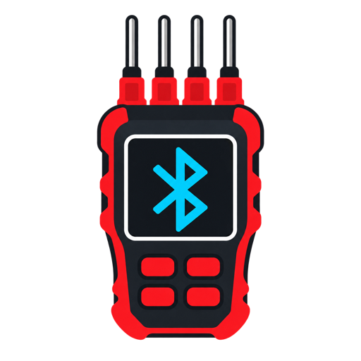

  

# UNI-T UT325F BLE for Home Assistant

A local Bluetooth integration for the **UNI-T UT325F four-channel thermocouple thermometer**. It exposes all four channels as temperature sensors in Home Assistant without the vendor app or a cloud service.

## Features

- Four temperature entities (`T1`–`T4`)
- Automatic Bluetooth discovery
- Works with a Home Assistant Bluetooth adapter or an ESPHome Bluetooth proxy
- Local communication; no account or cloud connection
- Automatic reconnection
- English and Hungarian setup screens

## Requirements

- Home Assistant 2025.1 or newer
- A connectable Bluetooth adapter or ESPHome Bluetooth proxy in range
- The UT325F in Bluetooth mode

Only one central can connect to the thermometer at a time. Close the UNI-T, iENV, nRF Connect, and similar phone apps before Home Assistant connects.

## Installation with HACS

1. In HACS, open **Integrations**.
2. Open the menu and choose **Custom repositories**.
3. Paste this repository's URL and select **Integration**.
4. Download **UNI-T UT325F BLE**.
5. Restart Home Assistant.
6. Turn on Bluetooth mode on the UT325F. Home Assistant should discover it automatically under **Settings → Devices & services**.

## Manual installation

Copy `custom_components/ut325f_ble` into the `custom_components` directory inside your Home Assistant configuration directory, then restart Home Assistant.

## Device protocol

The integration uses the meter's BLE UART service:

| Purpose | UUID |
| --- | --- |
| Service | `FF12` |
| Command write | `FF01` |
| Measurement notifications | `FF02` |

It subscribes to notifications, requests a measurement with `0x5E`, reassembles the meter's binary frame, and decodes four little-endian IEEE-754 temperatures. A channel with status byte `0x30` is treated as disconnected.

## Troubleshooting

- Confirm that the Bluetooth symbol on the UT325F is enabled.
- Disconnect the thermometer from phone apps before retrying.
- Move the thermometer closer to the Home Assistant adapter or Bluetooth proxy.
- Reload the integration after changing Bluetooth availability.
- When reporting a problem, include the Home Assistant version, connection method, and UT325F device name. Do not publish unrelated Home Assistant logs containing private information.

## Compatibility

Tested with a UNI-T UT325F advertising service `FF12` and characteristics `FF01`/`FF02`. Hardware or firmware revisions using another protocol may require additional support.

## License

MIT
